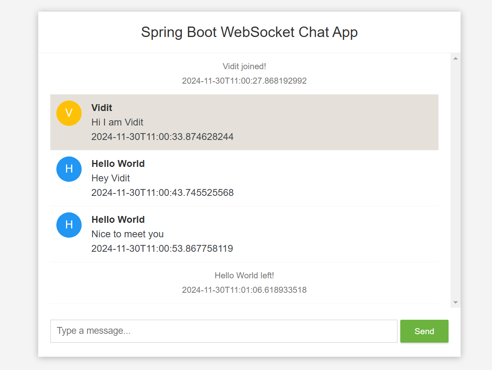

# Web Chat application
A hobby project made using Spring Boot to learn deeper concept.
## Live Demo
- Deployed successfully on Render.com
- Link: https://webchatapp-4pxc.onrender.com
- Screenshot:

## Requirements:
- Global web chat
- Show time-stamps of messages
- Allow sharing images on web chat
- Implement login and authentication
- Allow private chat
- Persist messages

## Technologies
- Spring Boot
- Web Socket Protocol
- HTML, CSS & JS